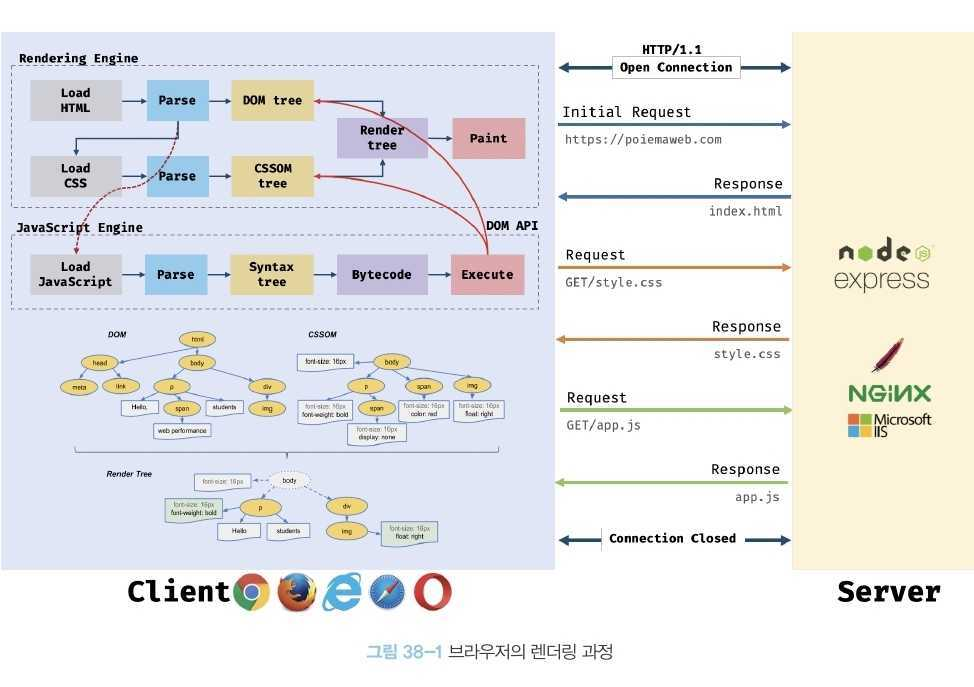
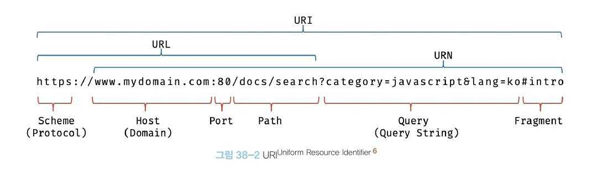
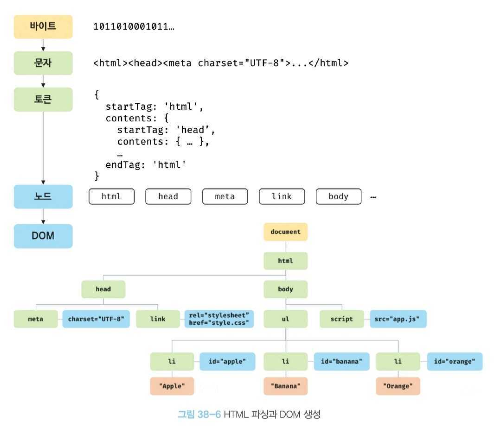
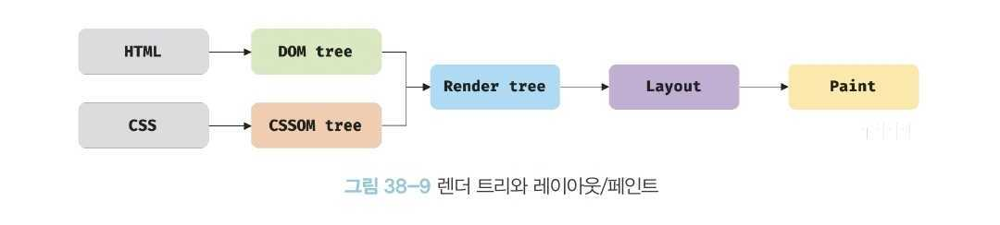
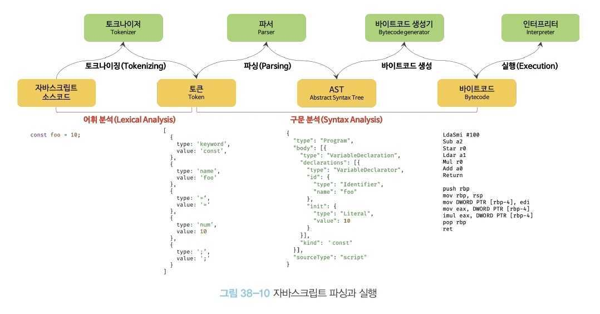
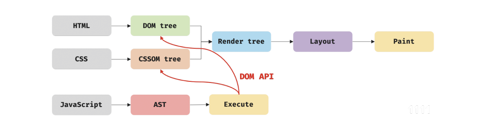

# 38. 브라우저의 렌더링 과정

브라우저가 `HTML`, `CSS`, `JavaScript`로 작성된 텍스트 문서를 어떻게 파싱(해석)하여 브라우저에 렌더링하는지 살펴보자.

### 🔥 용어 설명

- 파싱(Parsing):
  - 파싱(구문 분석)은 프로그래밍 언어의 문법에 맞게 작성된 텍스트 문서를 읽어 들여 실행하기 위해 텍스트 문서의 문자열을 토큰으로 분해(어휘 분석)하고, 토큰에 문법적 의미와 구조를 반영하여 트리 구조의 자료 구조인 파스 트리(parse tree/syntax tree)를 생성하는 일련의 과정을 말한다. 일반적으로 파싱이 완료된 이후에는 파스 트리를 기반으로 중간 언어인 바이트 코드로 생성하고 실행한다.
- 렌더링(Rendering):
  - 렌더링은 `HTML`, `CSS`, `JavaScript`로 작성된 문서를 파싱하여 브라우저 시각적으로 출력하는 것을 말한다.

### 브라우저 렌더링 과정(간략)

1. 브라우저는 `HTML`, `CSS`, `JavaScript`, 이미지, 폰트 파일 등 렌더링에 필요한 리소스를 요청하고 서버로부터 응답을 받는다.
2. 브라우저의 렌더링 엔진은 서버로부터 응답된 `HTML`과 `CSS`를 파싱하여 `DOM`과 `CSSOM`을 생성하고 이들을 결합하여 렌더 트리를 생성한다.
3. 브라우저의 자바스크립트 엔진은 서버로부터 응답된 `JavaScript`를 파싱하여 AST(Abstract Syntax Tree)를 생성하고 바이트 코드로 변환하여 실행한다. 이때 `JavaScript`는 DOM API를 통해 `DOM`이나 `CSSOM`을 변경할 수 있다. 변경된 `DOM`과 `CSSOM`은 다시 렌더 트리로 결합된다.
4. 렌더 트리를 기반으로 `HTML` 요소의 레이아웃(위치와 크기)를 계산하고 브라우저의 화면에 `HTML` 요소를 페인팅한다.

## 1. 요청과 응답

### 브라우저의 핵심 기능

- 필요한 리소스(`HTML`, `CSS`, `JavaScript`, 이미지, 폰트 파일 등의 정적 팡리 또는 서버가 동적으로 생성한 데이터)를 서버에 요청하고
- 서버로부터 응답을 받아
- 브라우저에 시각적으로 렌더링

=> 렌더링에 필요한 리소스는 모두 서버에 존재하므로 필요한 리소스를 서버에 요청하고 서버가 응답한 리소스를 파싱하여 렌더링하는 것이다.

### 서버 요청 동작 과정 예시

🔥 브라우저는 **주소창**을 통해 서버에게 필요한 리소스를 요청한다.
🔥 주소창에 URL을 입력하고 엔터키를 누르면 URL의 호스트 이름이 DNS를 통해 IP 주소로 변환되고 이 IP 주소를 갖는 서버에게 요청을 전송한다.

1. https://www.naver.com 을 입력하고 엔터키를 누르면 루트요청 (/, 프로토콜과 호스트만으로 구성된 URI에 의한 요청)이 naver.com 서버로 전송된다.

2. 서버는 루트 요청에 대해 암묵적으로 index.html을 응답하도록 기본 설정되어 있다.

3. 따라서 서버는 루트 요청에 대해 서버의 루트 폴더에 존재하는 정적 파일 index.html을 클라이언트(브라우저)로 응답한다.

‼️ 반드시 브라우저의 주소창을 통해 서버에게 정적 파일만을 요청할 수 있는 것은 아니다.

## 2. HTTP 1.1과 HTTP 2.0

HTTP(HyperText Transfer Protocol)는 **웹에서 브라우저(컴퓨터)와 서버가 통신하기 위한 프로토콜(규약)**이다.

### HTTP 1.1

- 기본적으로 커넥션당 하나의 요청과 응답만 처리한다.
- 여러 개의 요청을 한 번에 전송할 수 없고 응답 또한 마찬가지다.
- HTTP 1.1은 리소스의 동시 전송이 불가능한 구조이므로 **요청할 리소스의 개수에 비례햐여 응답 시간도 증가한다는 단점이 있다.**

### HTTP 2.0

- HTTP/2는 커넥션당 여러 개의 요청과 응답, 즉 다중 요청/응답이 가능하다.
- 따라서 HTTP/2.0은 여러 리소스의 동시 전송이 가능하므로 HTTP/1.1에 비해 페이지 로드 속도가 약 50% 정도 빠르다고 알려져 있다.

https://www.cloudflare.com/ko-kr/learning/performance/http2-vs-http1.1/

## 3. HTML 파싱과 DOM 생성

### HTML 파싱하여 DOM 생성해야 하는 이유

- 브라우저의 요청에 의해 서버가 응답한 `HTML` 문서는 문자열로 이루어진 순수한 텍스트다.
- 순수한 텍스트인 `HTML` 문서를 브라우저에 시각적인 픽셀로 렌더링하려면 `HTML` 문서를 브라우저가 이해할 수 있는 자료구조(객체)로 변환하여 메모리에 저장해야 한다.
- 따라서 `HTML` 문서를 파싱하여 브라우저가 이해할 수 있는 자료 구조인 `DOM(Document Object Model)`을 생성한다.

### 🔥 더 자세하게 과정을 파헤쳐보자!

1. 서버에 존재하던 HTML 파일이 브라우저의 요청에 의해 응답된다.

- 이때 서버는 브라우저가 요청한 HTML 파일을 읽어 들여 메모리에 저장한 다음
- 메모리에 저장된 바이트(2진수)를 인터넷을 경유하여 (브라우저에게) 응답한다.

2. 브라우저는 서버가 응답한 HTML 문서를 바이트(2진수) 형태로 응답받는다.

- 그리고 응답된 바이트 형태의 HTML 문서는 meta 태그의 charset 어트리뷰트에 의해 지정된 인코딩 방식(예: UTF-8)을 기준으로 문자열로 변환된다.
- 참고로 meta 태그의 charset 어트리뷰트에 선언된 인코딩 방식(예: UTF-8)은 content-type:text/html; charset=utf-8과 같이 응답 헤더에 담겨 응답된다.
- 브라우저는 이를 확인하고 문자열로 변환한다.

3. 문자열로 변환된 HTML 문서를 읽어 들여 문법적 의미를 갖는 코드의 최소 단위인 토큰들로 분해한다.

4. 각 토큰들을 객체로 변환하여 노드들을 생성한다.

- 토큰의 내용에 따라 문서 노드, 요소 노드, 어트리뷰트 노드, 텍스트 노드가 생성된다.
- 노드는 이후 DOM을 구성하는 기본 요소가 된다.

5. HTML 문서는 HTML 요소들의 집합으로 이루어지며 HTML 요소는 중첩 관계를 갖는다.

- 중첩 관계에 의해 부자 관계가 형성된다.
- 이러한 HTML 요소 간의 부자 관계를 반영하여 모든 노드들을 트리 자료구조로 구성한다.
- 이 노드들로 구성된 트리 자료구조를 DOM이라 부른다.

## 4. CSS 파싱과 CSSOM 생성

### CSS 파싱과 CSSOM 생성 과정(자세하게)

1. 렌더링 엔진이 `meta` 태그까지 `HTML`을 처음부터 한 줄씩 순차적으로 파싱하여 `DOM`을 생성해 나가다가 `CSS`를 로드하는 `link` 태그나 `style` 태그를 만나면 `DOM` 생성을 일시 중단하다.

2. `link` 태그의 `href` 어트리뷰트에 지정된 `CSS` 파일을 서버에 요청하여 로드한 `CSS` 파일, 또는 `style` 태그 내의 `CSS` 를

- `HTML` 과 동일한 파싱 과정(바이트 -> 문자 -> 토큰 -> 노드 -> CSSOM)을 거치며 해석하여 CSSOM(CSS Object Model)을 생성한다.
- CSSOM은 `CSS` **상속을 반영하여 생성된다.**

3. 이후 `CSS` 파싱을완료하면 `HTML` 파싱이 중단된 지점부터 다시 `HTML`을 파싱하기 시작하여 `DOM` 생성을 재개한다.

## 5. 렌더 트리 생성

### 렌더 트리 생성과정(자세하게!)

0. 렌더링 엔진은 서버로부터 응답된 HTML과 CSS를 파싱하여 각각 DOM과 CSSOM를 생성한다.

1. 생성된 DOM과 CSSOM은 렌더링을 위해 **렌더 트리**로 결합된다.

- 렌더 트리는 렌더링을 위한 트리 구조의 자료 구조다.
- 따라서 브라우저 화면에 렌더링 되지 않는 노드(예: meta tag, script tag etc..)와 CSS에 의해 비표시(예: display: none)되는 노드들은 포함하지 않는다.
- 즉, 렌더 트리는 **브라우저 화면에 렌더링 되는 노드**만으로 구성된다.

2. 이후 완성된 렌더 트리는 각 HTML 요소의 레이아웃(위치와 크기)을 계산하는 데 사용되며

3. 브라우저 화면에 픽셀을 렌더링하는 페인팅 처리에 입력된다.

‼️‼️‼️ 브라우저의 렌더링 과정은 반복해서 실행될 수 있는데? 언제??

- 자바스크립트에 의한 노드 추가 또는 삭제
- 브라우저 창의 리사이징에 의한 뷰포트 크기 변경
- HTML 요소의 레이아웃(위치, 크기)에 변경을 발생시키는 width/height, margin, padding, border, display: position, top/right/bottom/left 등의 스타일 변경

🔥🔥 브라우저 렌더링 과정이 반복되는 것은 과연 좋을까???

- 레이아웃 계산과 페인팅을 다시 실행하는 리렌덩링은 비용이 많이 드는 ==== 즉 성능에 악영향을 주는 작업이다.
- 따라서 가급적 리렌더링이 빈번하게 발생하지 않도록 주의할 필요가 있다!

## 6. 자바스크립트 파싱과 실행

1. `CSS` 파싱 과정과 마찬가지로 렌더링 엔진은 `HTML`을 한 줄씩 순차적으로 파싱하여 `DOM`을 생성해 나가다가 자바스크립트 파일을 로드하는 `script` 태그나 자바스크립트 콘텐츠로 담은 `script` 태그를 만나면 `DOM` 생성을 일시 중단한다.

2. `script` 태그의 `src` 어트리뷰트에 정의된 자바스크립트 파일을 서버에 요청하여 로드한 자바스크립트 파일이나 `script` 내의 자바스크립트 코드를 파싱하기 위해 **\*자바스크립트 엔진에 제어권을 넘긴다.**

3. 자바스크립트 엔진은 자바스크립트 코드를 파싱(해석)하여 AST(Abstract Syntax Tree, 추상적 구문 트리)를 생성한다.

4. AST를 기반으로 인터프리터가 실행할 수 있는 중간 코드인 바이트를 코드를 생성하여 실행한다.

‼️ 여기서 잠깐? 바이트 코드가 저수준 언어인가? (ChatGPT 답변)

- 바이트 코드는 일반적으로 고수준 언어와 저수준 언어 사이의 중간 수준 언어입니다. 바이트 코드는 기계어나 어셈블리 언어보다는 높은 수준의 추상화를 제공하지만, 직접 실행되지 않고 중간 단계로서 해석되거나 컴파일되어야 합니다.

바이트 코드는 주로 가상 머신에서 실행되며, 가상 머신은 바이트 코드 명령어를 원시 기계 코드로 해석하고 실행합니다. 바이트 코드는 대표적으로 자바 프로그래밍 언어에서 사용되며, Java 바이트 코드로 알려져 있습니다. 이것은 Java 가상 머신 (JVM)에서 실행됩니다.

따라서 바이트 코드는 저수준 언어보다는 높은 수준의 추상화를 제공하지만, 컴파일러 또는 해석기를 통해 실행 코드로 변환되어야 하므로 중간 수준의 언어로 간주됩니다.

5. 자바스크립트 엔진은 궁극적으로 자바스크립트 코드를 파싱하여 CPU가 이해할 수 있는 저수준 언어로 변환하고 실행한다.

6. 이후 자바스크립트 파싱과 실행이 종료되면 렌더링 엔진으로 제어권을 넘겨 `HTML` 파싱이 중단된 지점부터 다시 `HTML` 파싱을 시작하여 `DOM` 생성을 재개한다.

🔥 용어 설명

- 토크나이징: 단순히 문자열인 자바스크립트 소스코드를 어휘 분석하여 문법적 의미를 갖는 최소 단위인 토큰들로 분해한다.

- 파싱: 토큰들의 집합을 구문 분석하여 AST(추상적 구문 트리)를 생성한다. AST는 토큰에 문법적 의미와 구조를 반영한 트리 구조의 자료 구조다.

- 바이트코드 생성과 실행: 파싱의 결과물로 생성된 AST는 인터프리터가 실행할 수 있는 중간 코드인 바이트코드로 변환되고 인터프리터에 의해 실행된다.

## 7. 리플로우와 리페인트

1. 자바스크립트 코드에 `DOM`이나 `CSSOM`을 변경하는 `DOM API`가 사용된 경우 `DOM`이나 `CSSOM`이 변경된다. **이때 변경된 `DOM`과 `CSSOM`은 다시 렌더 트리로 결합되고 변경된 렌더 트리를 기반으로 레이아웃과 페인트 과정을 거쳐 브라우저의 화면에 다시 렌더링한다. 이를 리플로우, 리페인트라 한다.**

🔥 용어 설명(다시!!)

- 리플로우: 레이아웃 계산을 다시 하는 것을 말하며, 노드 추가/삭제, 요소의 크기/위치 변경, 윈도우 리사이징 등 레이아웃에 영향을 주는 변경이 발생한 경우에 한하여 실행된다.
- 리페인트: 재결합된 렌더 트리를 기반으로 다시 페인트를 하는 것을 말한다.

## 8. 자바스크립트 파싱에 의한 HTML 파싱 중단

- 렌더링 엔진과 자바스크립트 엔진은 병렬적으로 파싱을 실행하지 않고 직렬적으로 파싱을 수행한다. (브라우저는 동기적) ===> 이 말은 즉슨, 중간에 `script` 태그를 만나면 `HTML` 파싱이 블로킹되어 `DOM` 생성이 지연될 수 있다.

- 따라서 `script` 태그의 위치는 중요하다.

🔥🔥 예상되는 문제 상황!!

- 자바스크립트 파일에서 `DOM API`를 사용해 `DOM`, `CSSOM`을 변경하는 코드가 들어있는데
- 만약 해당 `DOM`, `CSSOM`이 아직 생성되기 전이라면???

오류가 발생한다.!!!

💧💧 이를 해결하기 위해서는

- body 요소의 가장 아래에 자바스크립트를 위치시키는 것이 좋은 아이디어다.
- 이렇게 하면 자바스크립트 로딩/파싱/실행으로 인해 HTML 요소들의 렌더링에 지장받는 일이 발생하지 않아 페이지 로딩 시간이 단축된다.

## 9. script 태그의 async/defer 어트리뷰트

- 자바스크립트 파싱에 의한 `DOM` 생성이 중단되는 문제를 근본적으로 해결하기 위해 HTML5부터 `script` 태그에 `async`와 `defer` 어트리뷰트가 추가되었다.

### `async`와 `defer` 공통점

- `src` 어트리뷰트를 통해 외부 자바스크립트 파일을 로드하는 경우에만 사용할 수 있다.
- 즉, `src` 어트리뷰트가 없는 인라인 자바스크립트에서는 사용할 수 없다.
- `HTML` 파싱과 외부 자바스크립트 파일의 로드가 비동기적으로 동시에 진행된다.

### `async`와 `defer` 차이점

- `async` 어트리뷰트
  - 자바스크립트의 파싱과 실행은 자바스크립트 파일의 로드가 완료된 후 진행되며, 이때 `HTML` 파싱이 중단된다.
  - 여러 개의 `script` 태그에 `async` 어트리뷰트를 지정하면 `script` 태그의 순서와는 상관없이 **로드가 완료된 자바스크립트**부터 먼저 실행되므로 **순서가 보장되지 않는다.**
- `defer` 어트리뷰트
  - 자바스크립트의 파싱과 실행은 `HTML` 파싱이 완료된 직후, 즉 DOM 생성이 완료된 직후(이때 DomContentLoaded 이벤트가 발생한다) 진행된다.
  - 따라서, `DOM` 생성이 완료된 이후 실행되어야 할 자바스크립트에 유용하다.
